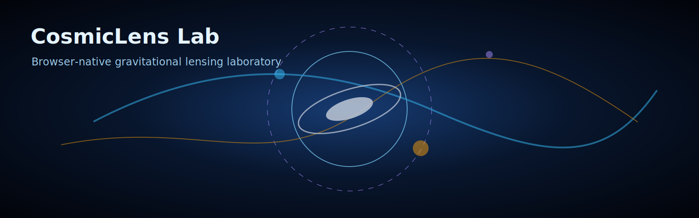

# CosmicLens Lab

<p align="center">
  <strong>A browser-native gravitational-lensing laboratory for strong-lensing physics, visualisation, validation, and shareable scientific demos.</strong>
</p>

<p align="center">
  
</p>

CosmicLens Lab is a research-inspired open-source project for building and exploring gravitational lens systems directly in the browser. It focuses on the thin-lens approximation, canonical strong-lensing mass models, caustics, critical curves, magnification, Fermat potential, time delays, synthetic imaging, and Python validation.

The repo is designed to be serious enough for astronomy students and scientific programmers, but visual enough to work as a flagship GitHub project.

## Why this repo exists

Most mature lensing software is Python-first, notebook-first, or research-pipeline-first. CosmicLens Lab is different:

- build lens systems interactively in the browser
- see lensed sources, critical curves, caustics, magnification maps, and time-delay surfaces
- switch between point-mass, SIS, SIE-like, NFW, Sérsic, composite, and shear models
- export every scene as versioned JSON
- revalidate browser equations in Python
- generate synthetic survey scenes with PSF and noise
- use the project as a learning lab, outreach tool, or prototyping sandbox

## Current status

This is a flagship-ready repository package with a functional cinematic web app, TypeScript physics core, deterministic animation engine, FrameGrid exporter, Python validation package, examples, tests, documentation, and CI/CD templates.

Scientific priority order:

1. correctness
2. reproducibility
3. visual clarity
4. performance


## 10x upgrade: cinematic animation + FrameGrid rendering

CosmicLens Lab is no longer a static starter demo. The current build includes a deployable cinematic research interface:

- live `requestAnimationFrame` animation loop
- six deterministic animation modes: source orbit, caustic breathing, shear rotation, subhalo flyby, Einstein-radius pulse, and time-delay sweep
- six scientific render modes: lensed image, magnification, time delay, parity, source-plane mapping, and residual/anomaly map
- export current canvas as PNG
- export full animation timeline as JSON
- export FrameGrid PNG filmstrips for README banners, papers, LinkedIn posts, and regression snapshots
- preset gallery: Quad Lab, Einstein Ring, Subhalo Flyby, NFW Cluster Arc Factory, and Fermat Time-Delay Sandbox
- TypeScript frame renderer in `packages/physics-core/src/frame.ts`
- deterministic animation engine in `packages/physics-core/src/animation.ts`
- Python frame-grid diagnostic exporter in `python/cosmiclens_validate/framegrid.py`

See [`docs/animation-rendering.md`](docs/animation-rendering.md) for the rendering architecture.

## Features

- Thin-lens equation and analytic model library
- Point mass, SIS, softened isothermal ellipse approximation, NFW radial helper, external shear
- Fermat potential and relative time-delay utilities
- Cinematic Canvas renderer with live animation, render modes, and export tools
- Scene import/export schema
- Python validation package with analytic point-mass and SIS checks
- Example scenes for textbook, galaxy, cluster, and cosmography demos
- GitHub Actions for CI and GitHub Pages deployment
- Documentation for physics, architecture, roadmap, validation, and contribution

## Quick start

```bash
npm install
npm run dev
```

Then open the local Vite URL printed in the terminal.

### Python validation

```bash
python -m venv .venv
source .venv/bin/activate  # Windows: .venv\Scripts\activate
pip install -e ./python
python -m cosmiclens_validate.point_mass
python -m cosmiclens_validate.sis
```

## Repository layout

```text
apps/web                 Browser app
packages/physics-core    TypeScript lensing equations and solvers
packages/schema          Versioned JSON scene schema
packages/render-webgpu   WebGPU capability and adapter layer
packages/render-webgl    WebGL2 fallback and texture helper layer
python/cosmiclens_validate Python reference validation tools
examples                 Reproducible scene JSON files
docs                     Scientific and engineering documentation
tests                    Cross-package regression fixtures
.github/workflows        CI and Pages deployment workflows
```

## Core equations

The project uses the standard thin-lens mapping

```math
\boldsymbol{\beta}=\boldsymbol{\theta}-\boldsymbol{\alpha}(\boldsymbol{\theta}),
```

with lensing potential

```math
\boldsymbol{\alpha}=\nabla\psi,\qquad \nabla^2\psi=2\kappa,
```

Jacobian

```math
\mathbf{A}=\frac{\partial\boldsymbol{\beta}}{\partial\boldsymbol{\theta}},
```

magnification

```math
\mu=\frac{1}{\det\mathbf{A}},
```

and Fermat potential

```math
\phi(\boldsymbol{\theta},\boldsymbol{\beta})=
\frac{1}{2}|\boldsymbol{\theta}-\boldsymbol{\beta}|^2-\psi(\boldsymbol{\theta}).
```

See [`docs/physics.md`](docs/physics.md) for the full derivation and implementation policy.

## MVP demo scenes

| Scene | File | Lesson |
|---|---|---|
| Point mass Einstein ring | `examples/textbook/point-mass-ring.json` | Exact analytic validation |
| SIS double image | `examples/textbook/sis-double.json` | Image multiplicity |
| SIE-like quad | `examples/galaxy/sie-quad.json` | Caustics and critical curves |
| Galaxy + halo composite | `examples/galaxy/composite-sersic-nfw.json` | Baryon-halo interplay |
| Time-delay toy lens | `examples/cosmography/time-delay-sandbox.json` | Fermat surface and H0 sensitivity |
| Subhalo anomaly | `examples/galaxy/subhalo-anomaly.json` | Local perturbation residuals |

## Development scripts

```bash
npm run dev          # start web app
npm run build        # build all packages and web app
npm run test         # TypeScript unit tests
npm run lint         # ESLint
npm run typecheck    # TypeScript type checking
npm run format       # Prettier check
```

## Validation philosophy

Every browser-facing scientific quantity should have either:

- an analytic reference test,
- a Python high-precision cross-check,
- or a documented numerical tolerance.

The first golden tests are point-mass image positions, SIS image multiplicity, external-shear Jacobian consistency, and Fermat stationary-point checks.

## Roadmap

- **MVP**: canonical lens models, canvas renderer, scene schema, Python validators
- **v1**: WebGPU kernels, FFT potential solver, synthetic noise/PSF, visual regression
- **v2**: differentiable inversion, subhalo residual inspector, multi-plane mode
- **v3**: time-delay cosmography toy MCMC, benchmark gallery, teaching notebooks

See [`docs/roadmap.md`](docs/roadmap.md).

## GitHub topics

Recommended topics:

```text
gravitational-lensing astrophysics cosmology astronomy scientific-visualization webgpu typescript python education dark-matter strong-lensing
```

## Citation

If you use this project in teaching, outreach, or research prototyping, cite the repository and the canonical lensing literature in [`docs/references.md`](docs/references.md).

## License

MIT. See [`LICENSE`](LICENSE).
