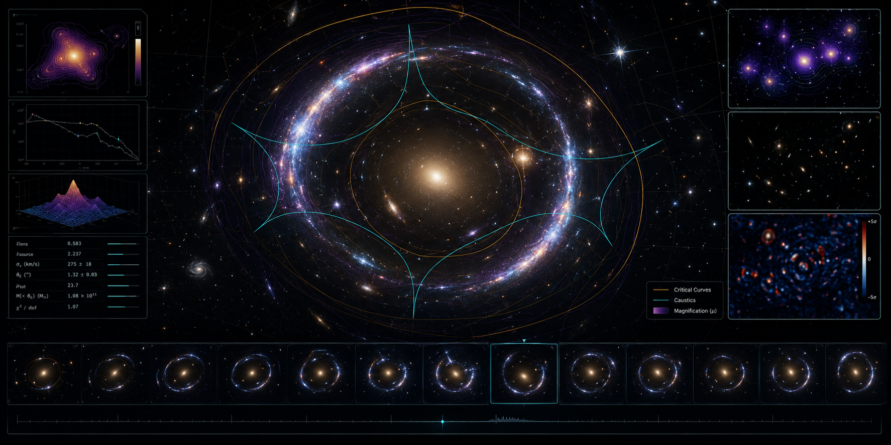

# CosmicLens Lab

<p align="center">
  
</p>

<p align="center">
  <strong>A browser-native gravitational-lensing laboratory for exploring Einstein rings, caustics, magnification maps, time delays, and strong-lensing model behaviour.</strong>
</p>

<p align="center">
  <a href="https://biswajit1999.github.io/Cosmic-Lens-Lab/">Live Demo</a>
  ·
  <a href="docs/physics.md">Physics Notes</a>
  ·
  <a href="docs/validation.md">Validation</a>
  ·
  <a href="docs/roadmap.md">Roadmap</a>
</p>

---

## Overview

**CosmicLens Lab** is an interactive astrophysics project for building and visualising gravitational-lens systems directly in the browser.

The aim is to make strong gravitational lensing feel like a live scientific laboratory rather than a static textbook diagram. Users can explore how foreground mass distributions bend light from background sources, forming Einstein rings, arcs, multiple images, caustics, critical curves, magnification structures, and time-delay surfaces.

The project combines:

- a browser-based visual interface,
- TypeScript lensing physics modules,
- deterministic animation and FrameGrid rendering,
- exportable scene configurations,
- and Python validation tools for reproducibility.

CosmicLens Lab is designed for astronomy students, educators, scientific programmers, outreach creators, and researchers who want a visual sandbox for lensing concepts.

---

## Live demo

Once GitHub Pages finishes deployment, the project should be available at:

```text
https://biswajit1999.github.io/Cosmic-Lens-Lab/
```

---

## What you can explore

| Area | What the project shows |
|---|---|
| **Strong lensing geometry** | How the lens equation maps image-plane positions to source-plane positions |
| **Einstein rings and arcs** | How alignment, lens mass, and source position change the observed image |
| **Caustics and critical curves** | Where image multiplicity and magnification change sharply |
| **Magnification maps** | Regions where sources are stretched, brightened, or distorted |
| **Fermat potential and time delays** | How different light paths arrive at different times |
| **Model comparison** | Behaviour of point-mass, SIS, SIE-like, NFW, Sérsic-inspired, composite, and shear models |
| **Animated lensing scenes** | Deterministic source orbits, shear rotation, subhalo flybys, Einstein-radius pulses, and time-delay sweeps |
| **Python validation** | Independent checks of analytic models and exported browser results |

---

## Why this project is different

Most mature gravitational-lensing tools are Python-first, notebook-first, or research-pipeline-first. CosmicLens Lab focuses on a different gap:

> **A shareable, browser-native, visually rich gravitational-lensing laboratory with reproducible physics and exportable scenes.**

It is not intended to replace professional lens-modelling packages. Instead, it provides an interactive front door for learning, demonstration, prototyping, visual explanation, and reproducible experimentation.

---

## Core features

### Interactive browser lab

- Real-time canvas-based lensing visualisation
- Preset scenes for rings, quads, clusters, time delays, and subhalo perturbations
- Adjustable source and lens parameters
- Multiple render modes:
  - lensed image
  - magnification map
  - time-delay / Fermat surface
  - parity map
  - source-plane mapping
  - residual / anomaly view

### Physics modules

- Thin-lens equation
- Point-mass lens
- Singular Isothermal Sphere
- SIE-like softened elliptical approximation
- NFW radial helper
- Sérsic-inspired profile support
- External shear
- Fermat potential and relative time-delay utilities

### Animation and export

- Deterministic animation engine
- FrameGrid filmstrip rendering
- Scene export as JSON
- Timeline export
- Canvas export as PNG
- Reproducible preset scenes

### Validation tools

- Python reference package
- Analytic point-mass checks
- SIS image-multiplicity checks
- Cross-language validation design
- Regression fixtures for future browser/Python comparisons

---

## Scientific scope

CosmicLens Lab currently focuses on **geometric-optics gravitational lensing in the thin-lens approximation**.

The central mapping is:

```math
\boldsymbol{\beta}
=
\boldsymbol{\theta}
-
\boldsymbol{\alpha}(\boldsymbol{\theta})
```

where:

- `θ` is the image-plane angular position,
- `β` is the source-plane angular position,
- `α(θ)` is the reduced deflection angle.

The lensing potential satisfies:

```math
\boldsymbol{\alpha} = \nabla \psi,
\qquad
\nabla^2 \psi = 2\kappa
```

and the magnification is obtained from the Jacobian of the lens mapping:

```math
\mu = \frac{1}{\det \mathbf{A}}
```

The Fermat potential used for time-delay visualisation is:

```math
\phi(\boldsymbol{\theta},\boldsymbol{\beta})
=
\frac{1}{2}
|\boldsymbol{\theta}-\boldsymbol{\beta}|^2
-
\psi(\boldsymbol{\theta})
```

See [`docs/physics.md`](docs/physics.md) for the full physics notes and implementation policy.

---

## Example scenes

| Scene | File | Purpose |
|---|---|---|
| Point-mass Einstein ring | `examples/textbook/point-mass-ring.json` | Exact analytic reference case |
| SIS double image | `examples/textbook/sis-double.json` | Image multiplicity and radial symmetry |
| SIE-like quad | `examples/galaxy/sie-quad.json` | Quad formation and caustic structure |
| Galaxy + halo composite | `examples/galaxy/composite-sersic-nfw.json` | Baryon-halo interplay |
| Subhalo anomaly | `examples/galaxy/subhalo-anomaly.json` | Local perturbation and residual signatures |
| Time-delay sandbox | `examples/cosmography/time-delay-sandbox.json` | Fermat surface and relative arrival times |
| Cluster arc factory | `examples/cluster/nfw-cluster-arc.json` | Cluster-scale lensing morphology |

---

## Repository structure

```text
.
├── apps/
│   └── web/                    Browser application
├── packages/
│   ├── physics-core/           TypeScript lensing equations and scene logic
│   ├── schema/                 Versioned JSON scene schema
│   ├── render-webgl/           WebGL2 capability and fallback helpers
│   └── render-webgpu/          WebGPU capability layer
├── python/
│   └── cosmiclens_validate/    Python validation tools
├── examples/                   Reproducible scene presets
├── docs/                       Physics, validation, architecture, roadmap
├── tests/                      Regression fixtures
└── .github/                    CI, issue templates, and Pages workflow
```

---

## Quick start

Install dependencies:

```bash
npm install
```

Run the web app locally:

```bash
npm run dev
```

Build the project:

```bash
npm run build
```

Run TypeScript checks and tests:

```bash
npm run typecheck
npm test
```

Run Python validation:

```bash
python -m venv .venv
source .venv/bin/activate
pip install -e ./python
PYTHONPATH=python pytest python/tests -q
```

On Windows PowerShell:

```powershell
python -m venv .venv
.venv\Scripts\Activate.ps1
pip install -e ./python
$env:PYTHONPATH="python"
pytest python/tests -q
```

---

## Validation philosophy

Every scientific quantity shown in the browser should eventually have at least one of the following:

- an analytic reference solution,
- a Python high-precision cross-check,
- a regression fixture,
- or a documented numerical tolerance.

Initial validation focuses on:

- point-mass image positions,
- SIS image multiplicity,
- deflection consistency,
- Fermat potential behaviour,
- and browser/Python scene-export parity.

See [`docs/validation.md`](docs/validation.md).

---

## Roadmap

### Current release

- Browser-based lensing scene viewer
- Core TypeScript physics package
- Deterministic animation engine
- FrameGrid rendering
- Example scene library
- Python validation package
- GitHub Pages deployment workflow

### Next milestones

- WebGPU-accelerated field solving
- FFT-based `κ → ψ → α` solver
- Improved SIE convention documentation
- More robust critical-curve and caustic extraction
- Visual regression tests for canonical scenes
- Synthetic PSF and noise pipeline
- Browser-to-Python residual heatmaps

### Longer-term direction

- Multi-plane educational mode
- Subhalo perturbation laboratory
- Differentiable inversion demo
- Time-delay cosmography toy model
- Teaching notebooks and benchmark gallery

See [`docs/roadmap.md`](docs/roadmap.md).

---

## Use cases

CosmicLens Lab can be used for:

- explaining gravitational lensing in outreach or lectures,
- generating visual material for astronomy posts,
- testing intuition about caustics and critical curves,
- comparing simple lens models,
- creating reproducible browser-based demos,
- and building a foundation for more advanced scientific visualisation tools.

---

## Project status

This repository is under active development.

The current version is suitable for educational exploration, visual demonstrations, and early scientific prototyping. It should not be treated as a precision cosmology or production lens-modelling pipeline.

---

## Contributing

Contributions are welcome, especially in:

- physics validation,
- numerical methods,
- rendering performance,
- documentation,
- example scenes,
- accessibility,
- and educational notebooks.

Please see [`CONTRIBUTING.md`](CONTRIBUTING.md) before opening a pull request.

---

## References

The project is based on standard gravitational-lensing theory and numerical-lensing literature. Key references and reading notes are listed in:

[`docs/references.md`](docs/references.md)

---

## Author

Created by **Biswajit Jana**.

GitHub: [@Biswajit1999](https://github.com/Biswajit1999)

---

## License

This project is released under the MIT License. See [`LICENSE`](LICENSE).
