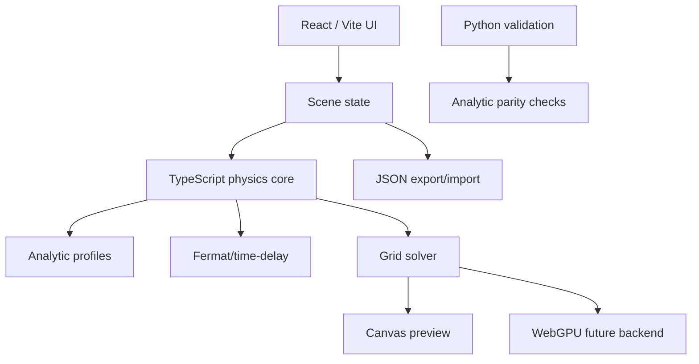

# Architecture

CosmicLens Lab is a static monorepo with four main layers.

## Packages

### `packages/physics-core`

Pure TypeScript equations, analytic model functions, vector helpers, and image-plane sampling utilities.

### `packages/schema`

Scene schema and default scene constructors. The schema is intentionally plain JSON so scenes can be shared as permalinks and used by Python validators.

### `packages/render-webgpu`

Capability layer and future compute-kernel host. WebGPU is not required for the MVP to run.

### `packages/render-webgl`

Fallback rendering capability layer. The MVP uses Canvas 2D for maximum portability.

### `apps/web`

The browser interface. It imports physics functions from `@cosmiclens/physics-core` and scene types from `@cosmiclens/schema`.

### `python/cosmiclens_validate`

Reference calculations for exact image positions and parity tests.

## Design rules

- Physics functions must be deterministic and side-effect free.
- UI state must be serialisable to a scene JSON object.
- New models must include tests and documentation.
- Browser approximations must be labelled honestly.
- Python validation should never depend on browser internals.
